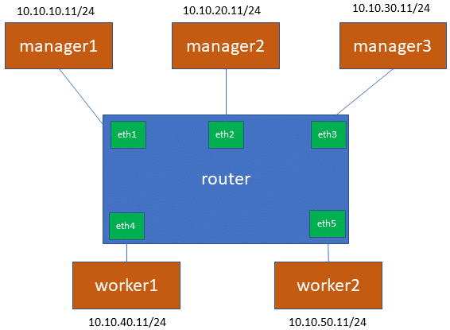

# swarmkit-stress-tester
Main purpose of this tool is to be able reproduce [moby/moby#35011](https://github.com/moby/moby/issues/35011) on lab environment so possible solutions can be also tested.

These scripts creates three managers + two workers configuration over single docker host.
All connections between these goes through router container so it is able generate connection failures between swarm nodes.


# Build test images
```bash
docker build . --build-arg GITHUBACCOUNT=docker --build-arg BRANCH=master -t swarmkit-stress-tester
docker build test-service -t test-service
```

# Usage
## Prepare
Start containers with script:
```bash
./start-containers.sh
```

## Debug
Open debug console and check list of nodes and services
```bash
docker run -it -v /var/run/docker.sock:/var/run/docker.sock -v /tmp/swarmkit-stress-tester:/tmp/swarmkit-stress-tester --rm --name debug swarmkit-stress-tester bash
swarmctl -s /tmp/swarmkit-stress-tester/manager1.sock node ls
swarmctl -s /tmp/swarmkit-stress-tester/manager1.sock service ls
```

## Actual stress tests
Open bash inside of router container:
```bash
docker exec -it router bash
```

### Running stress test
```bash
/scripts/run-stress-test.sh
```

## Debug
Open debug console and check list of nodes and services
```bash
docker run -it -v /var/run/docker.sock:/var/run/docker.sock -v /tmp/swarmkit-stress-tester:/tmp/swarmkit-stress-tester --rm --name debug swarmkit-stress-tester bash
swarmctl -s /tmp/swarmkit-stress-tester/manager1.sock node ls
swarmctl -s /tmp/swarmkit-stress-tester/manager1.sock service ls

# Try get logs from service and see that they fail
swarmctl -s /tmp/swarmkit-stress-tester/manager1.sock service logs bar
swarmctl -s /tmp/swarmkit-stress-tester/manager1.sock service logs foo
```

## Workaround
Workaround to issue is restart all managers one by one.
You can do that using command:
```bash
./workaround.sh
```


# Cleanup
This command will stop all containers and remove content of /tmp/swarmkit-stress-tester
```bash
./stop-containers.sh
```
